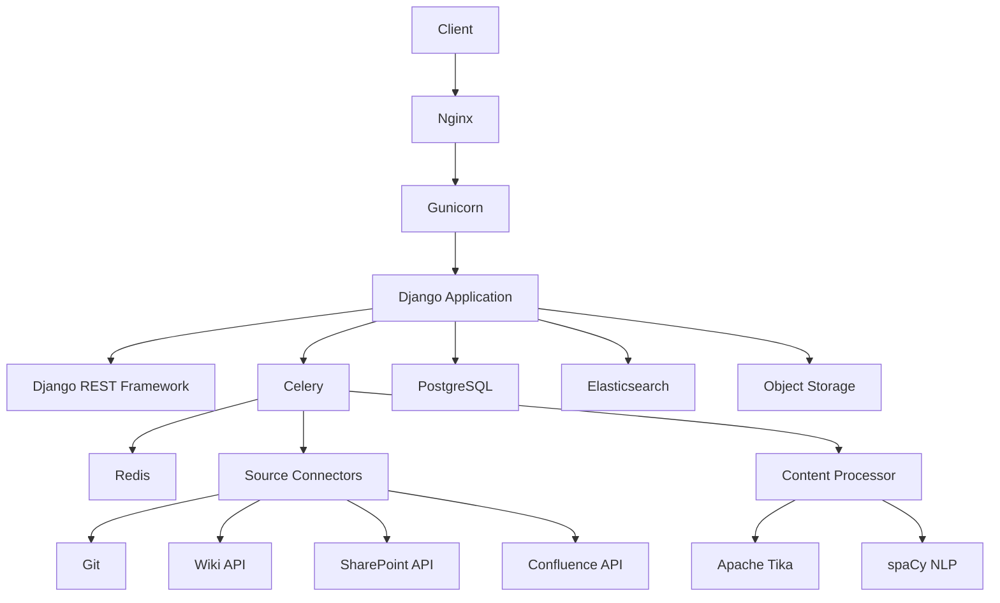
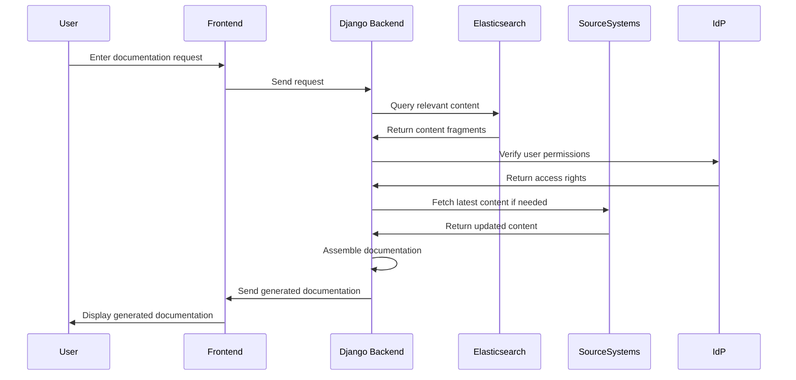

# Argonis: Unified Enterprise Knowledge Management System 🧙

## Project Overview

Argonis is an innovative, open-source knowledge management system designed to unify and optimize access to enterprise documentation across multiple platforms. It addresses the common challenge of scattered, duplicate, and outdated information in large organizations by providing a centralized search and documentation generation tool.

## Key Features

1. **Unified Search**: Seamlessly search across multiple documentation sources (Git repositories, Wikis, SharePoint, Confluence, etc.).
2. **Intelligent Content Indexing**: Advanced indexing of content with semantic analysis and keyword extraction.
3. **Deduplication and Version Control**: Identify and manage duplicate or similar content across different sources.
4. **Dynamic Documentation Generation**: Automatically create custom documentation based on user queries, assembling relevant content fragments from various sources.
5. **Access Control Integration**: Seamless integration with existing identity providers (e.g., Azure SSO SAML) for unified access management.
6. **Content Caching**: Intelligent caching system for improved performance without compromising on data freshness or security.
7. **Interactive Search Interface**: User-friendly search with auto-suggestions and natural language processing.
8. **Content Integrity Tracking**: Utilizes hash mechanisms and timestamps to track content updates efficiently.

## Deployment and Availability

- **Self-hosted**: Designed to be deployed on-premises or in a private cloud environment.
- **Open Source**: Freely available and open for community contributions.
- **Flexible Deployment Options**: 
  - Standard installer for traditional setups.
  - Docker container provided for easy deployment and scaling (Kubernetes-friendly).

## Architecture

Argonis employs a modular, scalable architecture designed for performance and flexibility.

### Key Components:

- **Django Application**: Core backend logic and API management
- **Elasticsearch**: Powers the unified search functionality
- **Celery & Redis**: Manage asynchronous tasks and caching
- **PostgreSQL**: Stores metadata, cross-references, and user data
- **Object Storage**: For caching processed content (Note: MinIO is used conceptually here, but the final implementation may vary)
- **Source Connectors**: Custom modules to interface with various documentation sources

## Workflow

1. **Content Ingestion**:
   - Source connectors periodically check for changes in documentation sources
   - New or updated content is extracted and normalized

2. **Content Processing**:
   - Apache Tika extracts text from various file formats
   - spaCy performs NLP tasks (keyword extraction, semantic analysis)
   - Content is hashed, and update timestamps are recorded

3. **Indexing and Storage**:
   - Processed and reformatted content is indexed in Elasticsearch
   - Metadata, hashes, timestamps, and cross-references are stored in PostgreSQL
   - Reformatted content is cached in the object storage, avoiding duplication of original data

4. **Search and Retrieval**:
   - User enters a query or documentation request
   - System processes the query through NLP to understand the intent
   - Elasticsearch provides relevant content fragments
   - Access permissions are checked against the IdP

5. **Dynamic Documentation Generation**:
   - Based on the user's query, the system automatically selects relevant content fragments
   - System assembles these fragments into a cohesive document
   - Final document is generated with proper formatting and structure

## Limitations and Challenges

1. **Initial Setup Complexity**: Integrating with various existing systems may require significant initial configuration.
2. **Performance at Scale**: Large enterprises with vast amounts of documentation may face performance challenges.
3. **Content Sync Latency**: Real-time synchronization with all source systems may not always be feasible.
4. **Access Control Granularity**: Matching the exact permission models of all source systems could be challenging.
5. **Language and Format Support**: Ensuring compatibility with all document formats and languages used in the enterprise.

## Future Enhancements

1. **AI-Powered Insights**: Implement machine learning models to provide content recommendations and identify knowledge gaps.
2. **Interactive Knowledge Graphs**: Develop visual representations of content relationships for intuitive navigation.
3. **Collaborative Editing**: Add features for real-time collaborative document creation and editing.
4. **Advanced Analytics**: Implement usage analytics to identify most valuable content and areas needing improvement.
5. **Mobile Application**: Develop a dedicated mobile app for on-the-go access to the knowledge base.
6. **Integration with Communication Tools**: Connect with platforms like Slack or Microsoft Teams for seamless information sharing.
7. **Automated Documentation Updates**: Implement systems to automatically update documentation based on code changes in monitored Git repositories. This powerful feature ensures that documentation stays in sync with code changes, significantly reducing manual update efforts and improving documentation accuracy.
