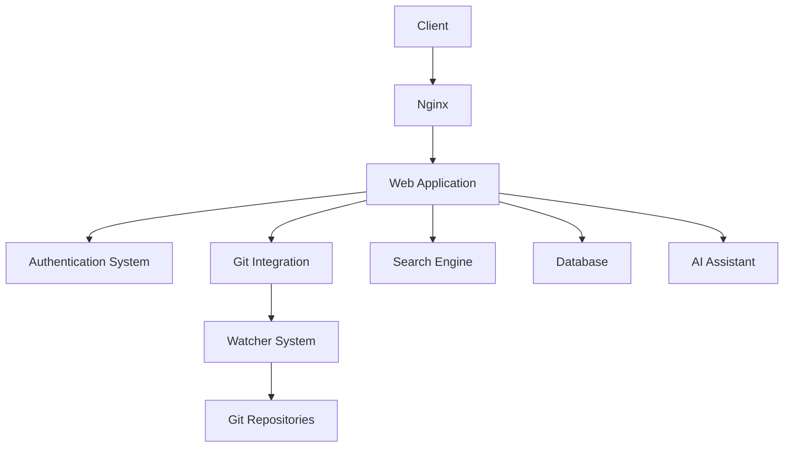

# Argonis: Enterprise Documentation Management System 🧙

## Project Overview

Argonis is an innovative, open-source documentation management system designed to streamline and optimize access to enterprise documentation. It addresses the common challenge of scattered and outdated information in organizations by providing a centralized, code-first approach to documentation management.

## Key Features (MVP)

1. **Doc-as-Code Platform**: Built on a foundation emphasizing a code-first approach to documentation.
2. **Authentication and Access Management**: Robust layer for secure access control and user management.
3. **Internal Document Editor**: Built-in editor for creating and modifying documentation directly within the platform. Changes are transformed into PRs, commits, or other formats depending on the configuration.
4. **Watcher System**: Intelligent system that monitors specific Git repositories for changes and suggests documentation updates based on code changes.
5. **Unified Search**: Seamless search functionality across all documentation within the platform.
6. **Version Control**: Integrated version control for all documentation, leveraging Git.
7. **AI-Assisted Post-Editing**: AI assistant to suggest links, content references, rephrasing, and translations.

## Deployment and Availability

- **Self-hosted**: Designed to be deployed on-premises or in a private cloud environment.
- **Open Source**: Freely available and open for community contributions.
- **Flexible Deployment Options**: 
  - Standard installer for traditional setups.
  - Docker container provided for easy deployment and scaling (Kubernetes-friendly).

## Architecture

Argonis employs a modular, scalable architecture designed for performance and flexibility.

## Workflow

1. **Content Creation and Editing**:
   - Users create or edit documentation using the internal editor or external tools
   - Changes are committed to the Git repository or transformed into PRs based on configuration

2. **Watcher System Monitoring**:
   - Watcher system observes configured Git repositories for changes
   - When changes are detected, it analyzes commits and pull requests

3. **Documentation Update Suggestions**:
   - Watcher system generates suggestions for documentation updates based on code changes
   - Users are notified of suggested updates via the platform, email, or other configured methods

4. **AI-Assisted Editing**:
   - AI assistant provides suggestions for links, references, rephrasing, and translations during the editing process

5. **Search and Retrieval**:
   - Users can search for documentation using the unified search interface
   - Results are filtered based on user permissions

## Roadmap

### Immediate Post-MVP Plans:

1. **Mobile Application**: 
   - Develop Android and iOS apps for on-the-go access to documentation

2. **Dynamic Documentation Generation**:
   - Implement system for creating adaptive content based on user needs and queries

### Future Enhancements:

1. **Advanced Analytics**: Implement usage analytics to identify valuable content and areas for improvement.
2. **Integration with Communication Tools**: Connect with platforms like Slack or Microsoft Teams for seamless information sharing.
3. **AI-Powered Insights**: Implement machine learning models to provide content recommendations and identify knowledge gaps.

## Get Involved

The project is currently in its early stages of development, and we're working hard to build a solid foundation. Here's how you can get involved and support the project:

- Star our repository to show your support and stay updated on our progress.
- Follow our project for the latest news and feature announcements.
- Share your thoughts, ideas, or use cases by opening an issue - we value your feedback as we shape the future of the platform!
- Spread the word about Argonis to colleagues who might be interested in our approach to documentation management.

As the project matures, we look forward to opening up more opportunities for community involvement.

---

Argonis is committed to evolving with the needs of modern enterprises, continually improving documentation management and accessibility.
